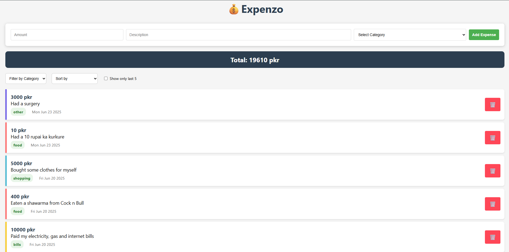

# 💸 Expenzo - Expense Tracker

**Expenzo** is a lightweight and responsive expense tracking web app built using **vanilla JavaScript**, **HTML**, and **CSS**. It allows users to add, view, and delete expenses with details like amount, description, category, and timestamp. All data is persisted using `localStorage`.

---

## 🚀 Features

- Add expenses with:
  - Amount
  - Description
  - Category
- View list of expenses
- See a running total
- Delete individual expenses
- Persist data using `localStorage`
- Responsive and clean UI
- Dynamic category color indicators
- Filters by category/date/amount
- Option to see only last 5 expenses

---

## 🛠️ Tech Stack

- **HTML**
- **CSS**
- **JavaScript (Vanilla)**

---

## 📂 File Structure
Expenzo-ExpenseTracker/
├── index.html
├── styles.css
├── script.js
└── README.md

## 📸 Screenshot

